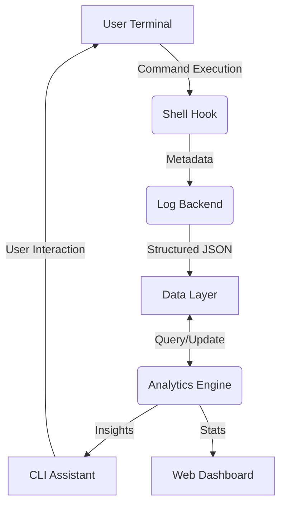

# 🐧 Linux Learning Assistant (LLA) v3.0 - Production Grade


An intelligent, automation-driven, and data-centric terminal ecosystem designed to transform the standard Linux tech diary into a professional mastery tool.

---

## 📖 Overview

### The Real-World Problem
For students and aspiring system administrators, mastering the Linux terminal often feels like a fragmented experience. Command history is fleeting, personal notes are disconnected from actual execution, and there is no structured way to track skill progression or receive context-aware recommendations.

### The Solution: LLA v3.0
The **Linux Learning Assistant (LLA)** bridge this gap by creating a unified layer between the user and the shell. It doesn't just log commands; it analyzes execution metadata, monitors safety, generates visual insights, and provides an adaptive learning path. It transforms a static diary into a "living" assistant that grows with the user.

---

## 🚀 Key Features

### 💻 Core Interaction (Software)
- **Interactive Fuzzy Palette**: Search through hundreds of commands and logs instantly using `fzf`.
- **Intelligent Logging Engine**: Captures exit codes, execution duration, PWD, and session context automatically via shell hooks.
- **Adaptive Recommendations**: Suggests advanced alternatives and new commands based on current usage gaps.

### 📊 Analytics & Automation
- **Real-Time Visualization**: A lightweight web dashboard for usage heatmaps and mastery streaks.
- **Auto-Diary Generation**: One-click generation of polished Markdown reports and tech diaries.
- **Git Mastery Sync**: Automated version control of your learning progress with structured commit messages.

### 🛡️ Safety & Reliability
- **Destructive Command Guard**: Regex-based detection of dangerous commands (e.g., `rm -rf /`) with immediate flagging.
- **Data Integrity**: JSON-based structured storage with validation to prevent corruption.

---

## 🏗️ System Architecture

The LLA operates on a layered architecture to ensure modularity and scalability:

1.  **Capture Layer (Shell Hooks)**: Intercepts terminal events and gathers high-fidelity metadata.
2.  **Data Layer (JSON Storage)**: Stores commands, logs, and profiles in a structured, queryable format.
3.  **Core Logic (Python Engines)**: Processes raw data for analytics, safety checks, and recommendations.
4.  **Presentation Layer (CLI & Web)**: Provides user interfaces via a high-performance CLI (Python/fzf) and a visualization dashboard (Flask/JS).



---

## 🛠️ Tech Stack

| Layer | Technologies |
| :--- | :--- |
| **Core Logic** | Python 3.8+, Dataclasses, JSON |
| **CLI Framework** | Bash, Python (Subprocess), fzf |
| **Web Dashboard** | Flask, Chart.js, HTML5/CSS3 |
| **Automation** | Git, Shell Scripting, Cron |
| **Data Storage** | Structured JSON |

---

## ⚙️ Setup and Installation

### Prerequisites
- **Python 3.8+** and **pip**
- **fzf** (Fuzzy Finder)
- **Git**

### Step-by-Step Installation

1. **Clone the Repository**:
   ```bash
   git clone https://github.com/santanu949/Linux_Project.git
   cd Linux_Project
   ```

2. **Run the Installer**:
   ```bash
   chmod +x advanced_lla/setup.sh
   ./advanced_lla/setup.sh
   ```

3. **Configure Your Shell**:
   Add the following line to your `~/.bashrc` or `~/.zshrc`:
   ```bash
   source $(pwd)/advanced_lla/shell/hook.sh
   ```

4. **Reload Shell**:
   ```bash
   source ~/.bashrc
   ```

---

## 📖 Usage Guide

### 1. Daily Interaction
Simply use your terminal as usual. The LLA shell hook runs in the background, logging your progress and checking for safety.

### 2. The Assistant CLI
Type `lla` to open the interactive menu. From here you can:
- **Search Palette**: Find commands and view their documentation.
- **View Stats**: Check your success ratios and top commands.
- **Get Recommendations**: See what the AI suggests you learn next.

### 3. Visual Dashboard
Launch the dashboard via the `lla` menu or directly:
```bash
python3 advanced_lla/web/app.py
```
Open `http://localhost:5000` in your browser.

---

## 📂 Project Structure

```text
advanced_lla/
├── bin/          # Executable entry points (CLI, Loggers)
├── core/         # Business logic (Analytics, Models, Automation)
├── shell/        # Shell hooks (Bash/Zsh integration)
├── data/         # Structured JSON storage (commands.json, logs.json)
├── web/          # Flask web dashboard and static assets
├── reports/      # Auto-generated MD/HTML reports
└── setup.sh      # Production-grade installer
```

---

## 📈 Current Status
- **Current Version**: v3.0 (Production-Grade)
- **Status**: Stable
- **Roadmap**: Plugin API enhancement, Zsh-native completions, and Cloud-sync support.

---

## 👥 Contributors
- **Santanu Biswajit Samanta** - *Lead Developer & Architect*

---
*Developed with ❤️ for the Linux Community.*
